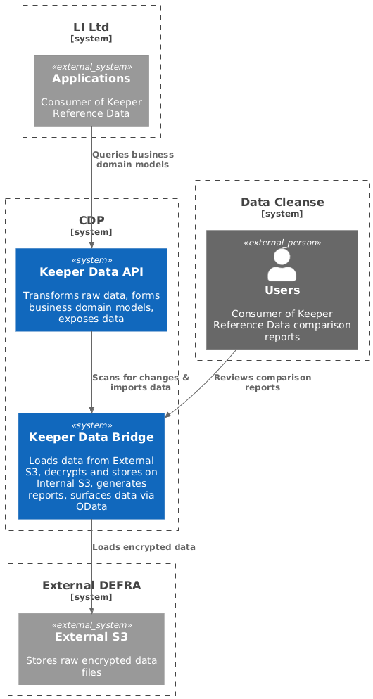
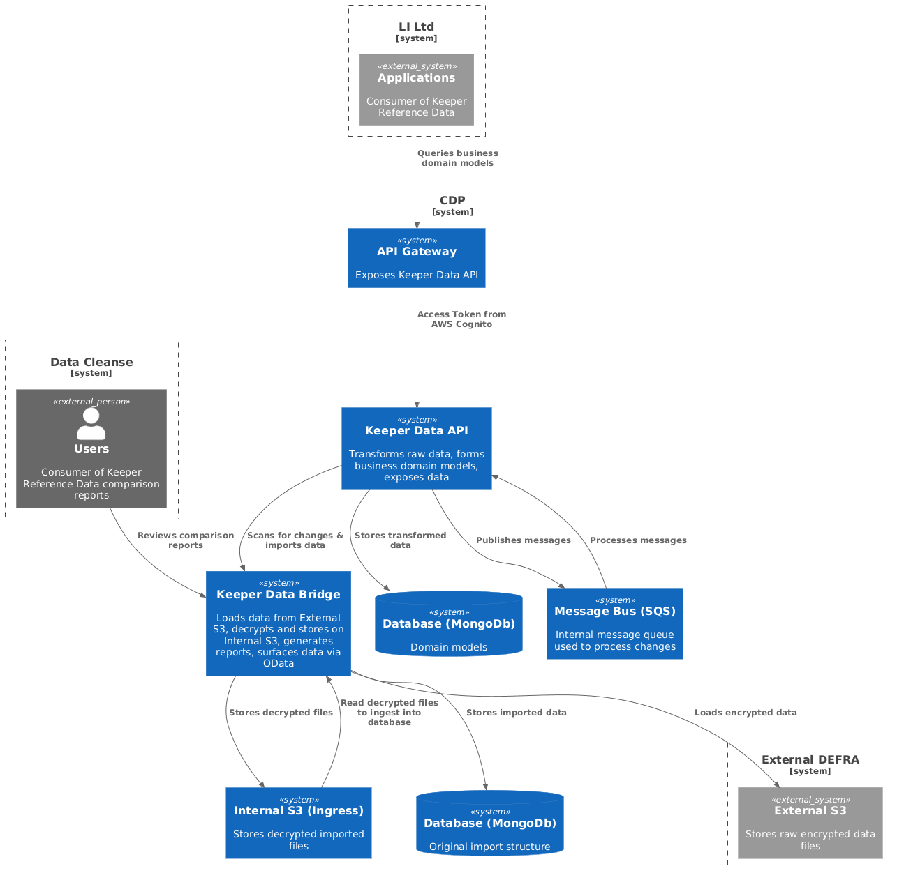

# Keeper Data API Runbook

## Service Overview

### What the API does
The Keeper Data API is a .NET 10 ASP.NET Core service that manages livestock keeper and site data for DEFRA. It provides REST endpoints for querying holdings, CPHs, CPH associations and user accounts, and maintains reference data for livestock management.

Key business functions:
- **Data Query Services**: Provides paginated REST endpoints to search and retrieve party, site and holding information
- **SQLite Read Model Caching**: Periodically downloads SQLite artifacts published by the data bridge and serves the `api/v2` endpoints from the local cache
- **Reference Data**: Serves seeded MongoDB reference data (species, countries, roles, site types, production usages)

> The legacy in-process ETL pipeline (Quartz scan jobs, SQS intake consumer, data-bridge `api/query` scanning, Mongo import orchestration) was retired under LKPR-204. The Mongo-backed public endpoints (`/api/sites`, `/api/parties`, `/api/countries`, `/api/sitetypes`, `/api/species`, `/api/reference/*`) remain in the codebase but return `404` unless `LegacyEndpointsEnabled` is set to `true`.

### High-level Architecture

#### System Context Diagram



#### Container Diagram



### Dependencies

**Primary Dependencies:**
- **MongoDB**: Database storing livestock data:
  - **Party Data**: Livestock keepers (parties)
  - **Site Data**: Holdings and premises (sites)
  - **Reference Data**: Species, countries, roles, premises types, production usage, site identifier types
  - **Relationship Data**: Party-site relationships, group marks, communications
  - **User Accounts**: User account records
- **Data Bridge API**: External service publishing the SQLite read-model artifacts consumed by the cache services

**Infrastructure Dependencies:**
- **Container Runtime**: Docker for containerized deployment

## Ownership & Contacts

**Primary Team:** TBD

**On-call Escalation:** TBD

**Communication Channels:**
- Slack Alerts:
  - #cas-team-alerts-non-prod (Defra Digital team Slack)
  - #cas-team-alerts-prod (Defra Digital team Slack))
- Teams:
  - MST-Defra-LITP Digital Delivery (Defra Teams)
- Jira:
  - https://eaflood.atlassian.net/jira/software/c/projects/ULITP/boards/6643
- Confluence:
  - https://eaflood.atlassian.net/wiki/spaces/LDD/pages/5785682190/Keeper+Reference+Data+Service+KRDS

## Operational Characteristics

**Expected Throughput:**
- API: TBD
- SQLite cache refresh: configured via `CphSqliteCache`/`ReadModelSqliteCache` `RefreshIntervalHours`

**Latency SLOs:**
- API Queries: TBD
- Health Checks: TBD

**Rate Limits:**
- API pagination: Default 10, max 500, Sites max 100

**Scheduled Operations:**
- None — the Quartz scan jobs were retired with the ETL pipeline (LKPR-204). The SQLite caches refresh in-process on a timer.

**Deployment:**
All deployment operations driven through the CDP portal: https://portal.cdp-int.defra.cloud/services/ls-keeper-data-api

## Monitoring & Observability

### Dashboards
Each environment has 2 corresponding Grafana dashboards:

**Service Dashboard** - Common performance metrics:
- CPU, memory and network usage
- Request rates and response times
- Error rates and status codes

**Custom Dashboard** - API-specific metrics:
- Overall health status
- Integration connectivity (MongoDB, Data Bridge API)
- Logged errors and warnings

All dashboards are linked in the CDP portal.

### Key Metrics

**HTTP Request Metrics (via ApplicationMetrics):**
- `requests_total`: Total number of requests by operation and status
- `duration_milliseconds`: Duration of operations in milliseconds
- `http_requests`: Request count with method, endpoint, status_code, status tags (via ExceptionHandlingMiddleware)
- `http_errors`: Error count with error_type, exception_type, status_code tags

**Health Check Metrics:**
- `keeperdata.health.status`: Current health status (2=Healthy, 1=Degraded, 0=Unhealthy)

### Log Locations

**Local Development:**
- Container logs via `docker compose logs keeperdata_api`
- Structured JSON logging with ECS format

**Deployed environments:**
- Logs stored in CloudWatch and accessed via OpenSearch
- Environment-specific log access links available in CDP portal

### Health Check Endpoints

- **Primary**: `GET /health` - Returns comprehensive system health
- **Basic**: `GET /` - Simple aliveness check (returns "Alive!")

### Alerts Configuration

**Standard CDP Alerts:**
- Standard set of CDP platform alerts configured for all environments

**Service-specific Alerts:**
- `ls-keeper-data-api-health-status`: Triggered if the healthcheck reports unhealthy

## Common Failure Modes & Incident Procedures

**TBD** - No specific failure modes or incidents have been identified yet. This section will be updated as operational experience is gained and patterns emerge.

## Local Tools

**Note:** For detailed local development procedures and setup instructions, see [README.md](README.md)

### Local Development
```bash
# Start full environment
docker-compose -f docker-compose.yml -f docker-compose.override.yml up --build -d

# View logs
docker compose logs -f keeperdata_api

# Stop environment
docker-compose down -v

# Run tests
## Excluding integration tests
dotnet test KeeperData.Api.sln --collect:"XPlat Code Coverage" --filter Dependence!=testcontainers

## Integration tests
dotnet test KeeperData.Api.sln --collect:"XPlat Code Coverage" --filter Dependence=testcontainers

# Format code
dotnet format ./KeeperData.Api.sln --verbosity diagnostic
```

### Health Checks
```bash
# Basic health check
curl http://localhost:5555/health

# Pretty-printed health status
curl http://localhost:5555/health | jq '.'

# Simple aliveness
curl http://localhost:5555/
```

### Service Restart
```bash
# Docker Compose restart
docker compose restart keeperdata_api

# Full environment restart
docker compose down && docker compose up -d
```

### Database Operations
```bash
# Connect to MongoDB (local)
mongosh mongodb://localhost:27019

# Check database status
mongosh --eval "db.adminCommand('ping')"
```

## CDP Tools

### Health Checks
```bash
# Basic health check
curl http://localhost:8085/health

# Pretty-printed health status
curl http://localhost:8085/health | jq '.'

# Simple aliveness
curl http://localhost:8085/
```

### Database Operations

**Note:** Mongo procedures TBD

## Release & Rollback Procedures

### Deployment Process
All deployments handled through the CDP Portal

### Rollback Process
Rollbacks are handled be redeploying the previous version through the CDP Portal

### Validation Steps
- Health check returns "Healthy"
- API endpoints respond correctly
- SQLite caches load the latest artifacts
- External integrations working
- No error spike in logs

## Configuration & Secrets

### Configuration Sources
- **Primary**: Environment variables
- **Local**: `docker-compose.override.yml`
- **Deployed**: Environment variables defined in `cdp-app-config` repo

### Key Configuration
```json
{
  "Mongo": {
    "DatabaseUri": "Connection string",
    "DatabaseName": "ls-keeper-data-api"
  },
  "CphSqliteCache": {
    "Enabled": true,
    "CachePath": "data/cache",
    "FilePattern": "cphs_",
    "LatestArtifactRoute": "api/etl/sqlite/cphs/latest",
    "RefreshIntervalHours": 24
  },
  "ReadModelSqliteCache": {
    "Enabled": true,
    "CachePath": "data/cache",
    "FilePattern": "krds-db_",
    "LatestArtifactRoute": "api/etl/staging/sqlite/latest",
    "RefreshIntervalHours": 24
  },
  "ApiClients": {
    "DataBridgeApi": {
      "BaseUrl": "External API base URL",
      "BridgeApiSubscriptionKey": "API key"
    }
  },
  "AdminEndpointsEnabled": false,
  "LegacyEndpointsEnabled": false
}
```

### Secret Rotation
1. Update secrets in secret management system
2. Update environment configuration
3. Restart service to pick up changes
4. Verify connectivity to all dependent services

## Security & Compliance

### Authentication/Authorization
- **Internal Service**: Basic and Bearer token handlers. Bearer tokens issued by AWS Cognito
- **Health Endpoints**: Anonymous access allowed
- **AWS Services**: Cognito based identity management, owned by CDP team

### API Gateway Client Credentials
 - **Recycling client secrets**: The team can request for the client secret to be recycled by the CDP team. The CDP team can rotate the credentials by creating a new one and then expiring the old one after confirmationo that the new one is in use. CDP do not enforce any fixed rotation period.
 - **Federated identity**: CDP do not support federated authorization/authentication with the API Gateway currently. The way identity providers work with API Gateway make client id the standard (for now at least).

### Data Classification
- **PII**: Contains personal information of livestock keepers
- **Business Critical**: Essential for livestock traceability
- **Retention**: Follow DEFRA data retention policies

### Audit Logging
- All API requests logged with correlation IDs
- Health check executions recorded
- Configuration changes audited

### Compliance Notes
- GDPR compliance for personal data
- DEFRA data handling requirements
- AWS security best practices

## Appendices

### API Specifications
- **OpenAPI/Swagger**: Swagger UI is available at `/swagger`; the generated v2 OpenAPI 3.1 contract is available at `/openapi/v2.json` and as `keeper-data-api-openapi_v2.json` on each GitHub Release from `main`.
- **Endpoints**:
  - `GET /api/v2/cphs` - Query CPHs from the SQLite cache
  - `GET /api/v2/cph-associations` - Retrieve CPH associations by email
  - `GET /api/v2/holdings/{county}/{parish}/{holding}` - Retrieve holding details by CPH
  - `POST /api/v2/user-accounts` - Ensure a user account exists
  - `GET /api/v2/user-accounts/{subject}` - Retrieve a user account by subject
  - `POST /api/admin/sqlite-cache/refresh` - Force a cache refresh (requires `AdminEndpointsEnabled`)
- **Legacy endpoints** (`/api/sites`, `/api/parties`, `/api/countries`, `/api/sitetypes`, `/api/species`, `/api/reference/*`): disabled by default; return `404` unless `LegacyEndpointsEnabled` is set to `true`. They only ever serve stale data now that ingest has moved to the data-bridge ETL.

### Known Quirks & Tribal Knowledge

**SQLite caches:**
- Both cache services are hosted services; on start-up they download the latest artifact from the data bridge and refresh on `RefreshIntervalHours`
- The `api/v2/cphs` endpoint returns `503` until the cache has loaded
- The admin refresh endpoint (`api/admin/sqlite-cache/refresh`) can force a reload and is gated by `AdminEndpointsEnabled`

**MongoDB:**
- Connection pooling managed automatically
- Health check uses simple ping command
- MongoDB transactions are not used

**Development Environment:**
- `ApiClients:DataBridgeApi:UseFakeClient` serves a fake artifact source for local development without the bridge
- Different Docker Compose overrides for Mac ARM vs Intel

### Useful Queries & Commands

**MongoDB Queries:**
```javascript
// Check collections
show collections

// Count documents in collections
db.parties.countDocuments()
db.sites.countDocuments()

// Recent updates
db.parties.find().sort({lastUpdatedDate: -1}).limit(10)
```

**Log Analysis:**
```bash
# Find correlation ID traces
grep "correlationId.*abc-123" <log-file>

# Watch cache refresh activity
grep "SqliteCache" <log-file> | tail -f

# Check health check patterns
grep "health.*check" <log-file>
```

---
*Last Updated: January 2026*
*Version: 1.0*
